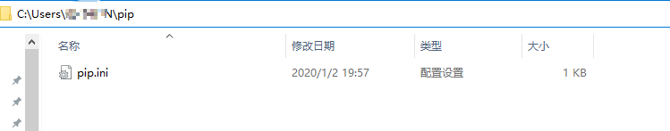

## 0. 计划


## 1. 安装
- 编译器 Pycharm/VSCODE
- 解释器 Python
- 创建虚拟环境
在终端中：
  - python -m venv xxxx
  - 进入Scripts    .\Activate.ps1
  - 如果执行失败，进入powershell(管理员)，执行 set-executionpolicy remotesigned，选Y
  - 应该显示这样的：
   <br>
   最后select interpreter

## 2. 变量类型 & 循环
### 2.1 变量类型
- Numbers（数字）
    - int（有符号整型）
    - long（长整型，也可以代表八进制和十六进制）
    - float（浮点型）
    - complex（复数）
- String（字符串）
- List（列表）
```
#!/usr/bin/python
# -*- coding: UTF-8 -*-
 
list = [ 'runoob', 786 , 2.23, 'john', 70.2 ]
tinylist = [123, 'john']
 
print list               # 输出完整列表
print list[0]            # 输出列表的第一个元素
print list[1:3]          # 输出第二个至第三个元素 
print list[2:]           # 输出从第三个开始至列表末尾的所有元素
print tinylist * 2       # 输出列表两次
print list + tinylist    # 打印组合的列表
```
- Tuple（元组）
```
元组是另一个数据类型，类似于 List（列表）。

元组用 () 标识。内部元素用逗号隔开。但是元组不能二次赋值，相当于只读列表。

实例(Python 2.0+)
#!/usr/bin/python
# -*- coding: UTF-8 -*-
 
tuple = ( 'runoob', 786 , 2.23, 'john', 70.2 )
tinytuple = (123, 'john')
 
print tuple               # 输出完整元组
print tuple[0]            # 输出元组的第一个元素
print tuple[1:3]          # 输出第二个至第四个（不包含）的元素 
print tuple[2:]           # 输出从第三个开始至列表末尾的所有元素
print tinytuple * 2       # 输出元组两次
print tuple + tinytuple   # 打印组合的元组
```
- Dictionary（字典）
```
字典(dictionary)是除列表以外python之中最灵活的内置数据结构类型。列表是有序的对象集合，字典是无序的对象集合。

两者之间的区别在于：字典当中的元素是通过键来存取的，而不是通过偏移存取。

字典用"{ }"标识。字典由索引(key)和它对应的值value组成。

实例(Python 2.0+)
#!/usr/bin/python
# -*- coding: UTF-8 -*-
 
dict = {}
dict['one'] = "This is one"
dict[2] = "This is two"
 
tinydict = {'name': 'runoob','code':6734, 'dept': 'sales'}
 
 
print dict['one']          # 输出键为'one' 的值
print dict[2]              # 输出键为 2 的值
print tinydict             # 输出完整的字典
print tinydict.keys()      # 输出所有键
print tinydict.values()    # 输出所有值
```
### 2.2 循环
- while 循环
  ```
    #!/usr/bin/python
    
    count = 0
    while (count < 9):
    print 'The count is:', count
    count = count + 1
    
    print "Good bye!"
  ```
- for 循环
  ```
    #!/usr/bin/python
    # -*- coding: UTF-8 -*-
    
    for letter in 'Python':     # 第一个实例
    print("当前字母: %s" % letter)
    
    fruits = ['banana', 'apple',  'mango']
    for fruit in fruits:        # 第二个实例
    print ('当前水果: %s'% fruit)
    
    print ("Good bye!")
  ```
- 嵌套循环
    ```
    #!/usr/bin/python
    # -*- coding: UTF-8 -*-
    
    i = 2
    while(i < 100):
    j = 2
    while(j <= (i/j)):
        if not(i%j): break
        j = j + 1
    if (j > i/j) : print i, " 是素数"
    i = i + 1
    
    print "Good bye!"
   ```
## 3. 包 PyPi pip
1. import 包名[.模块名 [as 别名]]
from 包名 import 模块名 [as 别名]
from 包名.模块名 import 成员名 [as 别名]
2. [PyPI](https://pypi.org/) :Find, install and publish Python packages with the Python Package Index
3. pip 是 Python 包管理工具，该工具提供了对Python 包的查找、下载、安装、卸载的功能。
   目前如果你在 python.org 下载最新版本的安装包，则是已经自带了该工具。
   - 临时换源：pip install -i https://pypi.tuna.tsinghua.edu.cn/simple xxxxx
   - 换源：
        新建pip.ini
        ```
        [global]
        index-url = http://mirrors.aliyun.com/pypi/simple/
        [install]trusted-host=mirrors.aliyun.com
        ```
        添加到：
        
   -  指定代理下载：pip install xxxx --proxy=ip:port